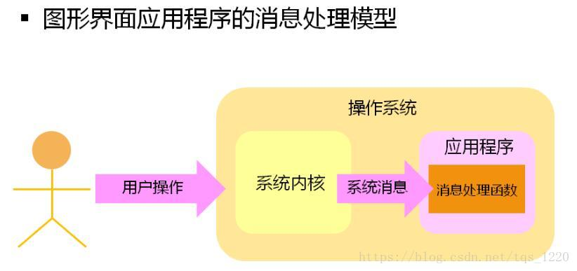
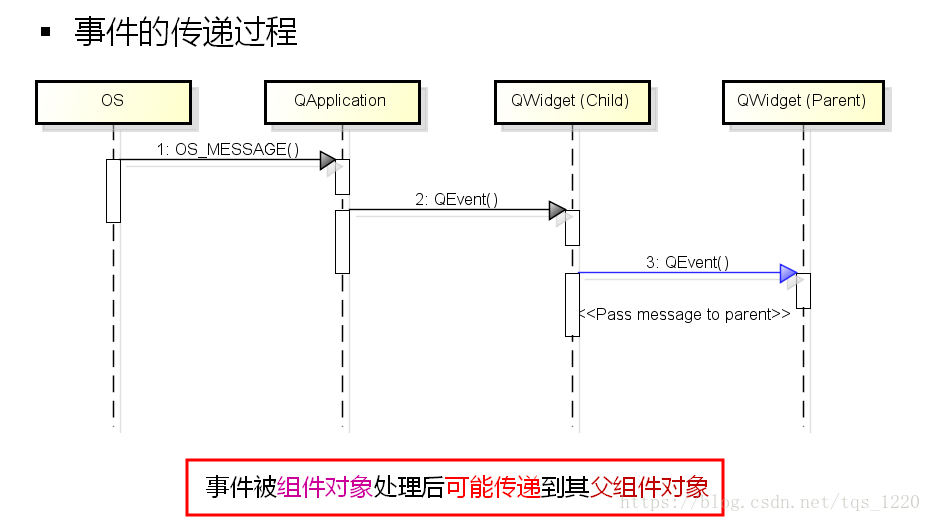
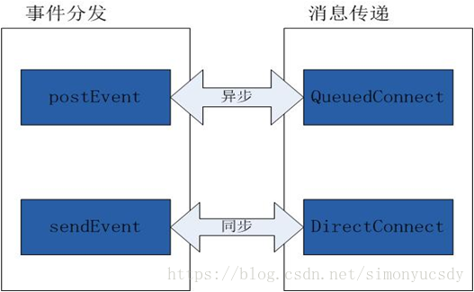
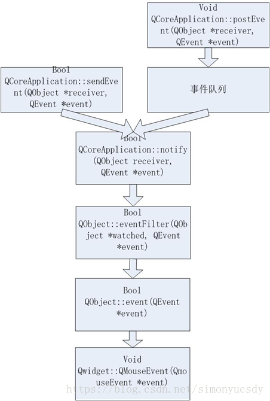
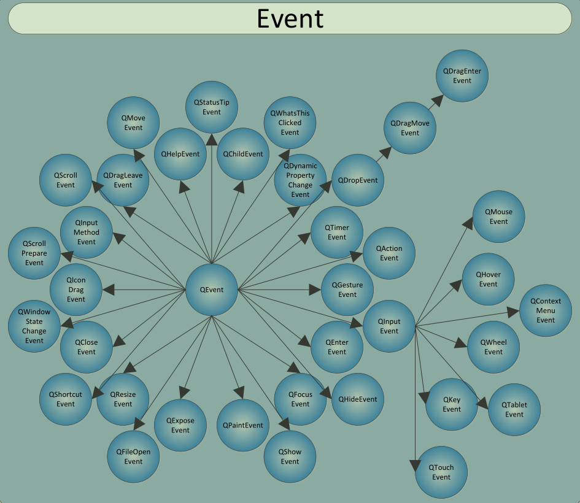

https://www.jianshu.com/p/48f007c2de09

https://blog.csdn.net/tqs_1220


**在 Qt 里，一个事件就是一个对象，所有事件的祖先都来自于 QEvent**

```cpp
class MyEvent : public QEvent
{
public:
    MyEvent();
    MyEvent(int x, int y, int z);
    static const Type type;	// 在处理事件时用于识别事件类的代号
    int x;
    int y;
    int z;
};

const QEvent::Type MyEvent::type = (QEvent::Type)QEvent::registerEventType();
```





事件分为两种

1. **在与用户交互时发生**。比如按下鼠标（*mousePressEvent*），敲击键盘（*keyPressEvent*）等。
2. **系统自动发生**，比如计时器事件（*timerEvent*）等。

在发生事件时（例如鼠标按下事件），就会产生一个 *QEvent* 对象（*QMouseEvent*，为*QEvent*的子类），这个 *QEvent* 对象会传给当前组件的 *event* 函数。如果当前组件没有安装**事件过滤器**，则会被*event*函数发放到相应的 *xxxEvent *函数中（这里是 *mousePressEvent* 函数）。




## 事件的处理流程

### 事件的创建和发送

事件有别于信号的重要一点：事件是一个类对象具有特定的类型，事件多数情况下是被分发到一个队列中(事件队列)，当队列中有事件时就不停的将队列中的事件发送给QObject对象，当队列为空时就阻塞地等待事件，这个过程就是事件循环！

另外一种同步处理情形是通过 sendEvent() 将事件发送出去，直接进入事件的传送和处理流程。

```c++
bool QCoreApplication::sendEvent(QObject *receiver, QEvent *event)
void QCoreApplication::postEvent(QObject *receiver, QEvent *event, int priority = 													Qt::NormalEventPriority)
void QCoreApplication::sendPostedEvents(QObject *receiver = Q_NULLPTR, int event_type = 0)
```

**sendEvent**

返回bool 类型说明执行后等待对方处理，事件对象不会被销毁，所以要在栈上创建 event 对象。

*postEvent* 和 *sendEvent* 的关系就像 *Qt::QueuedConnection* 和 *Qt::DirectConnection* 的关系

```c++
MyEvent myevent(1, 2, 3);
bool ret = QApplication::sendEvent(this, &myevent);
```

**postEvent**

`QApplication a(argc, argv); a.exec();` 的本质是不停的调用 processEvent() 函数从队列中获取事件来处理，postEvent() 作用是把事件送到这个队列中。事件必须在**堆**上创建。

```c++
MyEvent *myevent = new MyEvent(1, 2, 3);
QApplication::postEvent(this, myevent);
```

**sendPostedEvents**

立刻、马上将队列中的 event_type 类型的事件立马交给 receiver 进行处理。需要注意的是，来自窗口系统的事件并不由这个函数进行处理，而是 processEvent()。



## 事件处理

事件传给了 QObject 对象的 event 函数

### event 函数

*event* 函数的作用就在于**事件的分发**。

*event* 函数是事件处理的入口。

```C++
bool Widget::event(QEvent *e)
{
    if (e->type() == QEvent::KeyPress) 
    {
        QKeyEvent *keyEvent = static_cast<QKeyEvent *>(e);
        if (keyEvent->key() == Qt::Key_Tab) 
        {
            qDebug() << "You press tab.";
            return true;
        }
    }
    //按照原来的流程来进行事件的分发
    return QWidget::event(e);
}
```

**返回值：**

如果返回值是 true，那么 Qt 会认为这个事件已经处理完毕，不会再将这个事件发送给它的父对象，而是会继续处理事件队列中的下一事件。


### ignore && accept

当收到一个事件对象时，我先拿到这个事件。如果处理它，那么事情也就到此为止了；如果不去处理，它会传到我爸爸（基类）那儿去；他如果也不处理，就继续传给我的爷爷。

```
class Button : public QPushButton {
protected:
    virtual void mousePressEvent(QMouseEvent *ev) {
    	ev->ignore();
    	qDebug() << "Button1::mousePressEvent";
    }
    bool event(QEvent *e);
};
```


## 事件过滤

事件的传送和处理流程的第一站是事件过滤器 **eventFilter()**，某个对象A可以通过给另一个对象B安装事件处理器，实现对对象B事件的监听或者拦截功能。我们可以给A取名监听器，B取名接收器。一个对象可以监听多个对象，一个对象也可以被多个事件监听。事件过滤器返回true则表示事件已经处理完毕，否则传递给下一个监听器或者接收器本身。





> 事件过滤器和被安装过滤器的组件必须在同一线程，否则，过滤器将不起作用。另外，如果在安装过滤器之后，这两个组件到了不同的线程，那么，只有等到二者重新回到同一线程的时候过滤器才会有效。


```C++
Widget::Widget(QWidget *parent): QWidget(parent), m_LineEdit(this)
{
    m_LineEdit.installEventFilter(this);//安装事件过滤器
}
bool Widget::eventFilter(QObject* obj, QEvent* e)
{
    bool ret = true;
   if( (obj == &m_LineEdit) && (e->type() == QEvent::KeyPress) )
   {
       qDebug() << "Widget::eventFilter";
       QKeyEvent* keyEvent = dynamic_cast<QKeyEvent*>(e);
       switch(keyEvent->key())	//只有数字才会被传递到组件对象
       {
       case Qt::Key_0:
       case Qt::Key_1:
       case Qt::Key_2:
       case Qt::Key_3:
       case Qt::Key_4:
       case Qt::Key_5:
       case Qt::Key_6:
       case Qt::Key_7:
       case Qt::Key_8:
       case Qt::Key_9:
           ret = false;
           break;
       default:
           break;
       }
   }
   else
   {
       ret = QWidget::eventFilter(obj, e);
   }
   return ret;
}
```

结果返回true表示事件已经被处理，**不需要**传递给obj对象（其中**obj表示已经安装了事件过滤器的组件对象**）；返回false时**需要**传递到obj对象去进行处理。 





